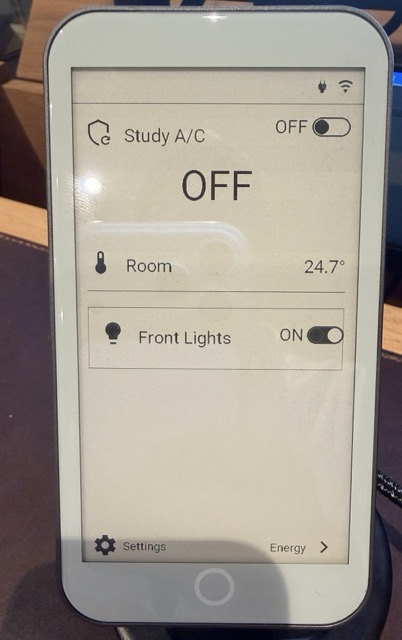
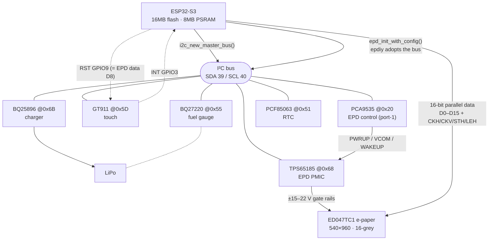
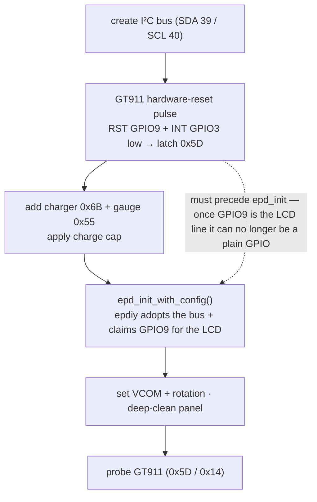

# ESPHome — LilyGO T5 E-Paper S3 Pro

An [ESPHome](https://esphome.io) `display` component for the **LilyGO T5 E-Paper S3 Pro**
(4.7" ED047TC1, 960×540, 16-grey, ESP32-S3), with **GT911 touch** and **battery monitoring**
built in. Drop it into a config, write a `lambda:`, get a touch-driven e-paper panel that
talks to Home Assistant.

<p align="center">
  
  <br><em>The board running under ESPHome. The dashboard is just an example — you build your own.</em>
</p>

> **Why this exists:** every other ESPHome component for the LilyGO T5 4.7" targets the older
> **Plus / V2.3** board. The **S3 Pro** is a different board (different power path, plus touch
> and a battery charger) and people have been stuck getting it working under ESPHome — most
> notoriously the **panel that boots, draws once, then locks to a stuck white screen.** This is
> that missing piece — display **and** touch **and** battery, with the white-screen root cause
> fixed — and the full recipe documented below so you don't have to rediscover it.

| | |
|---|---|
| **Display** | ED047TC1, 540×960 portrait (rotated), 16-level greyscale, driven via [epdiy](https://github.com/vroland/epdiy) |
| **Touch** | GT911 capacitive, exposed as an `on_touch:` trigger with `x`/`y` in display coordinates |
| **Home key** | The round capacitive button below the screen, exposed as an `on_home_button:` trigger |
| **Battery** | SOC / voltage / charging state (BQ27220 gauge + BQ25896 charger), plus a software charge-voltage cap |
| **Extras** | `deep_clean()` multi-flash de-ghost to clear e-paper ghosting |

---

## Quick start

```yaml
esp32:
  board: esp32-s3-devkitc-1
  flash_size: 16MB
  framework:
    type: esp-idf

psram:          # required — the 540x960 framebuffer lives in PSRAM
  mode: octal
  speed: 80MHz

external_components:
  - source: github://rktdno/esphome-lilygo-t5-epaper-s3-pro
    components: [t5_epaper]

font:                          # any font the lambda prints with must be defined — ESPHome ships none
  - file: "gfonts://Roboto"
    id: my_font
    size: 32

display:
  - platform: t5_epaper
    id: epd
    update_interval: 60s
    auto_clear_enabled: false   # we clear the framebuffer ourselves each frame
    lambda: |-
      it.printf(it.get_width() / 2, 100, id(my_font), TextAlign::TOP_CENTER, "Hello, e-paper");
    on_touch:
      then:
        - lambda: 'ESP_LOGI("touch", "tap at %d,%d", x, y);'
```

See [`example.yaml`](example.yaml) for a complete, standalone config (status screen, battery,
a tap counter, and a "Clean screen" button). It also carries a `dashboard_import:` block, so a
device flashed with it shows a one-click **Adopt** in your ESPHome dashboard — the generated
config just packages this file plus your WiFi secrets.

Flashing the first time is over USB (`esphome run example.yaml`); after that, OTA works over WiFi.
Flashing ESPHome is non-destructive — you can always reflash LilyGO's stock firmware over USB.

---

## Configuration

The platform extends the standard ESPHome [`display`](https://esphome.io/components/display/)
schema, so `update_interval`, `rotation` (handled internally — see below), `pages`, and
`lambda:` all work as usual.

| Option | Default | Notes |
|---|---|---|
| `update_interval` | `60s` | E-paper is slow; don't go below a few seconds. |
| `auto_clear_enabled` | set `false` | The component memsets the framebuffer white each frame; ESPHome's pixel-by-pixel auto-clear is redundant and slow here. |
| `on_touch:` | — | Automation trigger with `int x` and `int y` (already in display coordinates, top-left origin). |
| `on_home_button:` | — | Automation trigger (no args) for the round capacitive **home** key below the screen. Wire it to `id(epd).deep_clean();` for a hardware screen-clean, or anything else. |
| `vcom` | `1560` | Panel VCOM in millivolts. The exact value is printed on your panel's flex cable; the default is sane for the S3 Pro's ED047TC1. |
| `panel_rotation` | `inverted_portrait` | epdiy hardware rotation: `portrait` / `inverted_portrait` / `landscape` / `inverted_landscape`. Width/height are derived automatically. **Use this, not ESPHome's built-in `rotation:`** (that rotates in software on top). `inverted_portrait` puts the USB-C port at the bottom. |
| `default_charge_cap` | `100` | Software charge-voltage cap (60–100%). 100 = charge to full; lower it for an always-powered install. Also settable at runtime via `set_charge_cap_pct()`. |

### C++ API (call from lambdas)

```cpp
id(epd).battery_soc()           // int, 0..100 (% state of charge, -1 if unknown)
id(epd).battery_volts()         // float, pack voltage
id(epd).battery_charging()      // bool — actively charging (drives a charging-bolt glyph)
id(epd).on_charger()            // bool — external power present (solid rail; component uses GC16, else DU)
id(epd).charge_cap_pct()        // int, current software charge cap
id(epd).set_charge_cap_pct(80); // clamp 60..100 — see "Battery" below
id(epd).deep_clean();           // diff-safe full-panel refresh to clear ghosting, then repaint
id(epd).blank_frames()          // int — count of all-white frames skipped (white-out diagnostics)
```

### Battery & charge cap

The S3 Pro has a LiPo charger (BQ25896) and fuel gauge (BQ27220). The component reads SOC,
voltage and charging state, and can **cap the charge voltage in software** so a panel that
lives permanently on USB/Qi power doesn't sit pinned at 100% (high-voltage calendar wear).

The default cap is **100%** (charge to full). For an always-powered install, lower it — e.g.
`id(epd).set_charge_cap_pct(80)`, or wire a `number:` so you can tune it live from HA. Expose
the readings to HA with `template` sensors (see `example.yaml`).

### Cleaning the screen (ghosting)

E-paper accumulates faint ghosting from partial updates. The component does a deep flush **at boot**,
resyncs the panel to a known-good full repaint **every 20th refresh**, and you can force a full
de-ghost any time with `id(epd).deep_clean()` — handy on the **home button** (`on_home_button:`), an
on-screen button, or an HA service call.

`deep_clean()` is **diff-safe**: it renders the current view first and aborts if that came out blank
(so it can never flash the panel white with nothing to put back), then de-ghosts *through epdiy's diff
engine* rather than the low-level `epd_clear()`. On the charger it flashes the panel full **black↔white
three times** through the GC16 waveform — that's what actually scrubs ghosting (~3s of visible flashing,
like a Kindle full-refresh). Off the charger, repeated GC16 flashes risk the rail-sag white-screen
condition, so it falls back to a single light DU pass (a resync, not a true de-ghost) — dock on the
charger for a full clean. The "never `epd_clear()` at runtime" distinction is the whole ballgame on this
board; see the white-screen note in the recipe below.

The round capacitive **home key** below the screen is a GT911 capacitive key (not a separate GPIO) —
the example wires `on_home_button:` to `deep_clean()` so it's a one-press hardware screen-clean.

---

## How it works (the recipe)

If you're porting this board yourself, here's everything that was non-obvious:

1. **Use UPSTREAM epdiy, not LilyGO's fork.** LilyGO's `epdiy` fork is pinned to an old ESP-IDF
   and its `lcd_driver.c` won't build against ESPHome's current IDF (`lcd_ll_set_data_width`
   renamed, `lcd_periph_signals` gone, …). [vroland/epdiy](https://github.com/vroland/epdiy)
   `main` builds clean. We pull it as a managed component via `esp32.add_idf_component(...)`.
2. **`epd_board_v7` IS the T5 S3 Pro board.** Same PCA9555 port-1 control map. No custom board
   definition needed — just `epd_init(&epd_board_v7, &ED047TC1, …)`.
3. **Share one I²C bus.** epdiy initialises I²C in `epd_board_init` and holds it for the life of
   the program (only frees on `epd_deinit`), so a second bus for the GT911 / battery chips fails.
   Fix: **create the I²C bus yourself, then hand it to epdiy** via
   `epd_init_with_config(board, display, opts, &cfg)` where `cfg.i2c->bus_handle` is your bus
   (epdiy adds its PCA9555/TPS devices on it with `owns_bus = false`). ESPHome's `loop()`/`update()`
   run on one task, so shared-bus access never overlaps. *(This `EpdInitConfig`/`EpdI2cConfig` API
   is `main`-only — not in the v7/2.0.0 release tag yet — which is why `display.py` pins a commit.)*
4. **Wire the top-level `lambda:` yourself.** ESPHome's `register_display` / `setup_display_core_`
   set up pages/rotation/auto-clear but do **not** connect the top-level `lambda:` to the writer.
   The platform `to_code` must `process_lambda(...)` + `var.set_writer(...)`, or you get a blank
   screen.
5. **Colour inversion.** ESPHome's `COLOR_ON` is white; epdiy ink is `0 = black, 255 = white`.
   `draw_pixel_at` writes `255 - luminance`.
6. **Rotation.** `EPD_ROT_INVERTED_PORTRAIT` puts the USB-C port at the bottom (right-side-up),
   giving a 540×960 portrait panel.
7. **GT911 touch.** Poll status `0x814E` (bit 7 = data ready, low nibble = touch count), read 8
   bytes at `0x8150`: `x = pt[0] | pt[1]<<8`, `y = pt[2] | pt[3]<<8` (coordinates come out already
   in display space — no transform), then write `0` to `0x814E` to clear. Debounce on the rising
   edge.
8. **The side RST button leaves the GT911 stuck.** Pressing RST restarts the ESP32 but the GT911
   stops answering at **both** I²C addresses (0x5D *and* 0x14) even though the bus and the EPD
   still work — so probing both addresses doesn't recover it; only a full power cycle did. Fix: do
   an explicit **GT911 hardware-reset pulse on RST (GPIO9, INT low to latch 0x5D) at the very start
   of `setup()`, BEFORE `epd_init_with_config()`** claims GPIO9 for the LCD peripheral. (GPIO9 is
   shared with EPD data line D8 — reconfiguring it as plain GPIO *after* epd_init would detach it
   from the LCD and break rendering.)
9. **Home Assistant service calls are silently dropped** unless `allow_service_calls` is enabled
   on the device's config-entry **options** (default OFF since HA 2023.x). Enable it via the
   options flow if your `on_touch:` calls `homeassistant.service:` and nothing happens.
10. **Never call `epd_clear()` at runtime — this is what causes the "stuck white screen."** epdiy
    paints by *diffing* a front framebuffer against a back-buffer of what's on the panel, and only
    pushes the pixels that changed. `epd_clear()` whitens the **physical** panel directly, bypassing
    that diff — so epdiy still believes the old content is on screen. If the back-buffer doesn't get
    resynced (e.g. a refresh that didn't fully complete), every subsequent push diffs against stale
    state, finds "no change," and no-ops **forever**: the panel is stuck white and only a reflash or
    a pixel that happens to toggle ever draws again. The fix is to drive the panel **only** through
    `epd_hl_update_screen()`, and do periodic de-ghosting with `epd_hl_set_all_white()` (which resets
    the back-buffer, so the next push legitimately repaints everything). A failed refresh then degrades
    to *stale content*, never blank. `epd_clear()` is safe **only at boot**, before any content exists
    to strand. This component does exactly that — it's why the screen stays alive.
11. **Use `MODE_DU` off-charger, `MODE_GC16` on the charger.** A full 16-level GC16 refresh draws high
    sustained current across many waveform frames; on a marginal battery rail it can sag mid-waveform,
    leaving the draw incomplete while epdiy marks the back-buffer "drawn" — the same diff-desync →
    stuck-white failure as above. Off external power, refresh with the light, fast, low-current 1-bit
    `MODE_DU` (you lose greyscale shading but the UI stays legible and the panel never strands); switch
    back to crisp GC16 when the rail is solid (on charger). Read on-charger live from the BQ25896
    (REG0B `PG_STAT`), and gate the push on the PCA9555 power-good bit (recipe step above).
12. **The round "home" key below the screen is a GT911 capacitive key — not a GPIO.** A press shows up in
    the GT911 status register (`0x814E`): bit7 (data-ready) **plus bit4 (HaveKey)**, with a touch count of
    0 → `status == 0x90`. (A normal screen tap is bit7 + a non-zero touch count, never bit4.) So poll
    `0x814E`, and if bit4 is set, treat it as the home button. The key-value register `0x8093` was useless
    here (constant), so just key off the status bit. The component exposes this as the `on_home_button:`
    trigger. (It is **not** wired to any PCA9555 pin or GPIO0 — those were dead ends.)
13. **A real de-ghost needs multiple full GC16 flashes, not one white pass.** A single white-then-repaint
    leaves visible residue. Flash the whole panel black↔white a few times — each inversion drives every
    pixel through the greyscale waveform. Do it through `epd_hl_update_screen()` (solid frames via the diff
    engine), never `epd_clear()` (recipe step 10), and only on the charger (the sustained current sags a
    battery rail — recipe step 11).

---

## Architecture

The crux of this board: there's **one I²C bus**, and epdiy insists on owning it (it inits I²C in
`epd_board_init` and holds it for life). So the component creates the bus itself and hands it to
epdiy via `epd_init_with_config` — after which the EPD power chip, the touch controller, the
charger and the gauge all live on that single shared bus.



`setup()` order matters — the GT911 reset has to happen *before* epdiy claims GPIO9 for the LCD:



## Hardware reference

**I²C bus** (SDA 39 / SCL 40): PCA9535 `0x20` · RTC PCF85063 `0x51` · BQ27220 gauge `0x55` ·
GT911 touch `0x5D` · BQ25896 charger `0x6B` · TPS65185 EPD PMIC `0x68` (only appears after WAKEUP).

**Pinout** (from LilyGO's factory `utilities.h` — the published docs are wrong): touch INT 3 / RST 9;
SPI MISO 21 / MOSI 13 / SCLK 14; SD_CS 12; LoRa CS 46 / IRQ 10 / RST 1 / BUSY 47; GPS RX 44 / TX 43;
PCA9535_INT 38; BL_EN 11; BOOT 0.

**EPD control = PCA9555 port 1** (board = epdiy `epd_board_v7`): OE=PC10 · MODE=PC11 · STV=PC12 ·
PWRUP=PC13 · VCOM_CTRL=PC14 · WAKEUP=PC15 · PWRGOOD=PC16 (in) · INT=PC17 (in). Port-0 P00 = LoRa/GPS power.

---

## Roadmap

- **v0.2** — an optional `touch: false` to disable the GT911 polling.
- Optional: a 64-byte data-cache-line `sdkconfig` to let epdiy run the pixel clock at 20 MHz
  (it auto-drops to 10 MHz on ESPHome's default 32-byte line) — refresh-speed only.
- Longer term: explore upstreaming an epdiy-backed display platform into ESPHome core.

Done in v0.1: configurable VCOM / panel rotation / default charge cap, and `dashboard_import`
for one-click adoption from the ESPHome dashboard.

Contributions welcome.

---

## Credits

- [epdiy](https://github.com/vroland/epdiy) by vroland and contributors — the e-paper driver
  (LGPL-3.0), pulled in as a managed component. **Note:** this currently pins a small
  [fork](https://github.com/rktdno/epdiy) that adds a timeout to `epd_board_v7`'s power-good wait
  (upstream busy-waits forever on a supply dip — [vroland/epdiy#481](https://github.com/vroland/epdiy/pull/481));
  it reverts to upstream once that merges. Edit `EPDIY_REPO`/`EPDIY_REF` in `display.py` to change it.
- LilyGO for the [T5 E-Paper S3 Pro](https://lilygo.cc) hardware and the factory firmware that
  documents the real pinout.

## License

MIT — see [LICENSE](LICENSE). (epdiy is fetched separately at build time under its own LGPL-3.0 license.)
