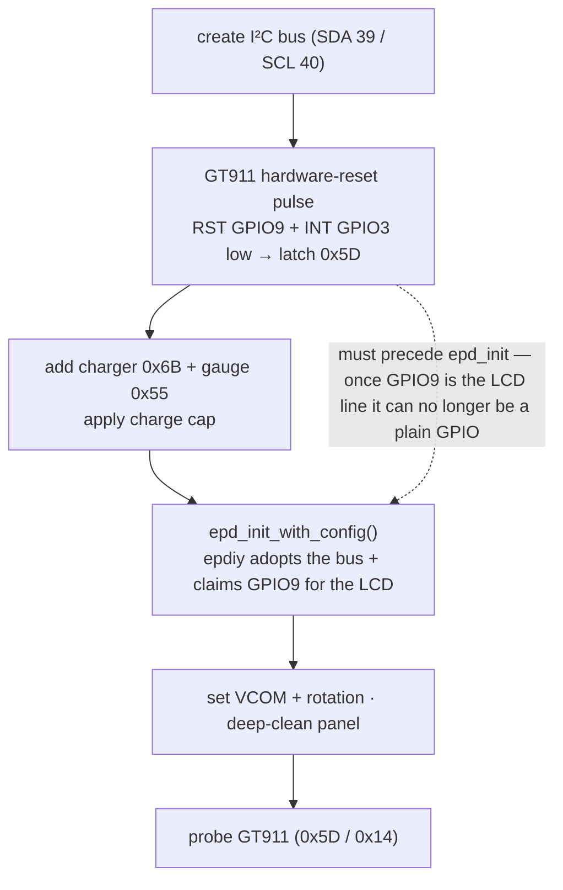

# ESPHome — LilyGO T5 E-Paper S3 Pro

An [ESPHome](https://esphome.io) `display` component for the **LilyGO T5 E-Paper S3 Pro**
(4.7" ED047TC1, 960×540, 16-grey, ESP32-S3), with **GT911 touch** and **battery monitoring**
built in. Drop it into a config, write a `lambda:`, get a touch-driven e-paper panel that
talks to Home Assistant.

<p align="center">
  
  <br><em>The board running under ESPHome. The dashboard is just an example — you build your own.</em>
</p>

> **Why this exists:** every other ESPHome component for the LilyGO T5 4.7" targets the older
> **Plus / V2.3** board. The **S3 Pro** is a different board (different power path, plus touch
> and a battery charger) and people have been stuck getting it working under ESPHome — most
> notoriously the **panel that boots, draws once, then locks to a stuck white screen.** This is
> that missing piece — display **and** touch **and** battery, with the white-screen root cause
> fixed — and the full recipe documented below so you don't have to rediscover it.

| | |
|---|---|
| **Display** | ED047TC1, 540×960 portrait (rotated), 16-level greyscale, driven via [epdiy](https://github.com/vroland/epdiy) |
| **Touch** | GT911 capacitive, exposed as an `on_touch:` trigger with `x`/`y` in display coordinates |
| **Home key** | The round capacitive button below the screen, exposed as an `on_home_button:` trigger |
| **Battery** | SOC / voltage / charging state (BQ27220 gauge + BQ25896 charger), plus a software charge-voltage cap |
| **Extras** | Checked recovery, unchanged-frame skips, `clean_screen()` light clean and `deep_clean()` multi-flash de-ghost |

---

## Quick start

```yaml
esp32:
  board: esp32-s3-devkitc-1
  flash_size: 16MB
  framework:
    type: esp-idf

psram:          # required — the 540x960 framebuffer lives in PSRAM
  mode: octal
  speed: 80MHz

external_components:
  - source: github://rktdno/esphome-lilygo-t5-epaper-s3-pro
    components: [t5_epaper]

font:                          # any font the lambda prints with must be defined — ESPHome ships none
  - file: "gfonts://Roboto"
    id: my_font
    size: 32

display:
  - platform: t5_epaper
    id: epd
    update_interval: 60s
    auto_clear_enabled: false   # we clear the framebuffer ourselves each frame
    lambda: |-
      it.printf(it.get_width() / 2, 100, id(my_font), TextAlign::TOP_CENTER, "Hello, e-paper");
    on_touch:
      then:
        - lambda: 'ESP_LOGI("touch", "tap at %d,%d", x, y);'
```

See [`example.yaml`](example.yaml) for a complete, standalone config (status screen, battery,
a tap counter, and a "Clean screen" button). It also carries a `dashboard_import:` block, so a
device flashed with it shows a one-click **Adopt** in your ESPHome dashboard — the generated
config just packages this file plus your WiFi secrets.

Flashing the first time is over USB (`esphome run example.yaml`); after that, OTA works over WiFi.
Flashing ESPHome is non-destructive — you can always reflash LilyGO's stock firmware over USB.

---

## Configuration

The platform extends the standard ESPHome [`display`](https://esphome.io/components/display/)
schema, so `update_interval`, `rotation` (handled internally — see below), `pages`, and
`lambda:` all work as usual.

| Option | Default | Notes |
|---|---|---|
| `update_interval` | `60s` | E-paper is slow; don't go below a few seconds. |
| `auto_clear_enabled` | set `false` | The component memsets the framebuffer white each frame; ESPHome's pixel-by-pixel auto-clear is redundant and slow here. |
| `on_touch:` | — | Automation trigger with `int x` and `int y` (already in display coordinates, top-left origin). |
| `on_home_button:` | — | Automation trigger (no args) for the round capacitive **home** key below the screen. Wire it to `id(epd).deep_clean();` for a hardware screen-clean, or anything else. |
| `home_button_debounce` | `1s` | Minimum interval between home-key triggers; increase it for slower actions. |
| `vcom` | `1560` | Panel VCOM in millivolts. The exact value is printed on your panel's flex cable; the default is sane for the S3 Pro's ED047TC1. |
| `panel_rotation` | `inverted_portrait` | epdiy hardware rotation: `portrait` / `inverted_portrait` / `landscape` / `inverted_landscape`. Width/height are derived automatically. **Use this, not ESPHome's built-in `rotation:`** (that rotates in software on top). `inverted_portrait` puts the USB-C port at the bottom. |
| `default_charge_cap` | `100` | Software charge-voltage cap (60–100%). 100 = charge to full; lower it for an always-powered install. Also settable at runtime via `set_charge_cap_pct()`. |

### C++ API (call from lambdas)

```cpp
id(epd).battery_soc()           // int, 0..100 (% state of charge, -1 if unknown)
id(epd).battery_volts()         // float, pack voltage
id(epd).battery_charging()      // bool — actively charging (drives a charging-bolt glyph)
id(epd).on_charger()            // bool — external power present (solid rail; component uses GC16, else DU)
id(epd).charge_cap_pct()        // int, current software charge cap
id(epd).set_charge_cap_pct(80); // clamp 60..100 — see "Battery" below
id(epd).clean_screen();         // checked white + content pass, without repeated flashing
id(epd).deep_clean();           // three checked black/white GC16 cycles on charger, then repaint
id(epd).unchanged_frames()      // identical frames skipped after a successful draw
id(epd).draw_failures()         // failed/uncertain display transactions
id(epd).clean_count()           // successful cleaning transactions
id(epd).blank_frames()          // int — count of all-white frames skipped (white-out diagnostics)
```

### Battery & charge cap

The S3 Pro has a LiPo charger (BQ25896) and fuel gauge (BQ27220). The component reads SOC,
voltage and charging state, and can **cap the charge voltage in software** so a panel that
lives permanently on USB/Qi power doesn't sit pinned at 100% (high-voltage calendar wear).

The default cap is **100%** (charge to full). For an always-powered install, lower it — e.g.
`id(epd).set_charge_cap_pct(80)`, or wire a `number:` so you can tune it live from HA. Expose
the readings to HA with `template` sensors (see `example.yaml`).

### Cleaning the screen (ghosting)

Normal updates and manual cleaning share one checked transaction. The component validates
the rendered content before any white-out, refuses unknown/low battery off-charger, and
requires successful power-on before issuing a waveform. Both drawing and power-off errors
invalidate the previous-frame state. Recovery makes up to three retries, five seconds apart,
then leaves further attempts to the configured update interval. Missing power-good reads
fail closed. A failed I²C bus can also prevent physical rail shutdown; the power driver logs
that limitation rather than claiming success.

`clean_screen()` establishes a white panel using the existing difference buffer and then
paints the preserved content. The same pass happens every twentieth successful content push;
unchanged-frame skips do not advance the cleaning counter. The front buffer is never discarded
during cleaning, and the back buffer is synchronised only after a checked white pass succeeds.
`epd_hl_set_all_white()` alone does **not** clean the panel: the pinned epdiy implementation
clears the front buffer, not the back buffer.

`deep_clean()` retains the stronger public API: after establishing white, it drives three
black/white GC16 cycles on external power, then repaints the prevalidated content. Every pass
is checked, and a failure stops the sequence and enters the same recovery path. Off-charger
it uses the lighter white/content pass. A clean requested while power is unsuitable stays
pending. No extra framebuffer is allocated and no runtime `epd_clear()` is used.

The round home key is exposed through `on_home_button:`. Choose `clean_screen()` for a quick
refresh or `deep_clean()` for the stronger multi-flash operation; the example uses the latter.
The component does not impose a home-key action on consuming configurations.

---

## How it works (the recipe)

If you're porting this board yourself, here's everything that was non-obvious:

1. **Use the pinned current-IDF epdiy fork, not LilyGO's older fork.** The managed component
   pin retains the shared-I²C API, checked/bounded V7 power transitions (upstream #481), and
   pointer-array allocation fix (#488). It is tested with ESP-IDF 5.5.4. Do not replace the
   pin with upstream `main` without checking that those fixes and backend compatibility remain.
2. **`epd_board_v7` IS the T5 S3 Pro board.** Same PCA9555 port-1 control map. No custom board
   definition needed — just `epd_init(&epd_board_v7, &ED047TC1, …)`.
3. **Share one I²C bus.** epdiy initialises I²C in `epd_board_init` and holds it for the life of
   the program (only frees on `epd_deinit`), so a second bus for the GT911 / battery chips fails.
   Fix: **create the I²C bus yourself, then hand it to epdiy** via
   `epd_init_with_config(board, display, opts, &cfg)` where `cfg.i2c->bus_handle` is your bus
   (epdiy adds its PCA9555/TPS devices on it with `owns_bus = false`). ESPHome's `loop()`/`update()`
   run on one task, so shared-bus access never overlaps. The exact dependency commit is pinned
   in `display.py` so the shared-bus and checked-power APIs are reproducible.
4. **Wire the top-level `lambda:` yourself.** ESPHome's `register_display` / `setup_display_core_`
   set up pages/rotation/auto-clear but do **not** connect the top-level `lambda:` to the writer.
   The platform `to_code` must `process_lambda(...)` + `var.set_writer(...)`, or you get a blank
   screen.
5. **Colour inversion.** ESPHome's `COLOR_ON` is white; epdiy ink is `0 = black, 255 = white`.
   `draw_pixel_at` writes `255 - luminance`.
6. **Rotation.** `EPD_ROT_INVERTED_PORTRAIT` puts the USB-C port at the bottom (right-side-up),
   giving a 540×960 portrait panel.
7. **GT911 touch.** Poll status `0x814E` (bit 7 = data ready, low nibble = touch count), read 8
   bytes at `0x8150`: `x = pt[0] | pt[1]<<8`, `y = pt[2] | pt[3]<<8` (coordinates come out already
   in inverted-portrait space), transform them for the configured `panel_rotation`, then write
   `0` to `0x814E` to clear. Debounce on the rising edge. Touch and framebuffer coordinates
   are host-tested against epdiy for all four rotations.
8. **The side RST button leaves the GT911 stuck.** Pressing RST restarts the ESP32 but the GT911
   stops answering at **both** I²C addresses (0x5D *and* 0x14) even though the bus and the EPD
   still work — so probing both addresses doesn't recover it; only a full power cycle did. Fix: do
   an explicit **GT911 hardware-reset pulse on RST (GPIO9, INT low to latch 0x5D) at the very start
   of `setup()`, BEFORE `epd_init_with_config()`** claims GPIO9 for the LCD peripheral. (GPIO9 is
   shared with EPD data line D8 — reconfiguring it as plain GPIO *after* epd_init would detach it
   from the LCD and break rendering.)
9. **Home Assistant service calls are silently dropped** unless `allow_service_calls` is enabled
   on the device's config-entry **options** (default OFF since HA 2023.x). Enable it via the
   options flow if your `on_touch:` calls `homeassistant.service:` and nothing happens.
10. **Keep physical display state and diff state together.** A runtime `epd_clear()` bypasses
    the diff engine. If the physical panel changes while the back buffer still describes old
    content, an identical requested image can be skipped incorrectly. The shared update path
    invalidates diff state after uncertain draws, establishes white with a forced DU pass,
    and only then synchronises the back buffer and paints content. `epd_hl_set_all_white()`
    clears the **front** buffer in the pinned dependency; it is not a back-buffer reset.
    Raw `epd_clear()` is used only for the checked boot flush, before household content exists.
11. **Use `MODE_DU` off-charger, `MODE_GC16` on the charger.** A full 16-level GC16 refresh draws high
    sustained current across many waveform frames; on a marginal battery rail it can sag mid-waveform,
    leaving the draw incomplete while epdiy marks the back-buffer "drawn" — the same diff-desync →
    stuck-white failure as above. Off external power, refresh with the light, fast, low-current 1-bit
    `MODE_DU` (you lose greyscale shading, but reduce the refresh load); switch
    back to crisp GC16 when the rail is solid (on charger). Read on-charger live from the BQ25896
    (REG0B `PG_STAT`), and gate the push on the PCA9555 power-good bit (recipe step above).
12. **The round "home" key below the screen is a GT911 capacitive key — not a GPIO.** A press shows up in
    the GT911 status register (`0x814E`): bit7 (data-ready) **plus bit4 (HaveKey)**, with a touch count of
    0 → `status == 0x90`. (A normal screen tap is bit7 + a non-zero touch count, never bit4.) So poll
    `0x814E`, and if bit4 is set, treat it as the home button. The key-value register `0x8093` was useless
    here (constant), so just key off the status bit. The component exposes this as the `on_home_button:`
    trigger. (It is **not** wired to any PCA9555 pin or GPIO0 — those were dead ends.)
13. **Keep stronger de-ghosting explicit.** `deep_clean()` retains three full black/white GC16
    cycles on the charger. They use checked full-screen difference transitions, preserving the
    content buffer. Normal/periodic cleaning uses one white/content pass to avoid unnecessary
    flashing. Optical ghosting quality still needs checking on the physical panel.
14. **Use the 1 KiB LUT on this S3 LCD backend.** The difference renderer uses the same vector
    path as the 64 KiB option, so this saves 63 KiB of internal RAM. The line-queue fix in the
    dependency also saves 14.75 KiB for this panel's two render threads. Measure actual minimum
    heap and largest free block when adding Bluetooth or image decoding.

---

## Architecture

The crux of this board: there's **one I²C bus**, and epdiy insists on owning it (it inits I²C in
`epd_board_init` and holds it for life). So the component creates the bus itself and hands it to
epdiy via `epd_init_with_config` — after which the EPD power chip, the touch controller, the
charger and the gauge all live on that single shared bus.


`setup()` order matters — the GT911 reset has to happen *before* epdiy claims GPIO9 for the LCD:



## Hardware reference

**I²C bus** (SDA 39 / SCL 40): PCA9535 `0x20` · RTC PCF85063 `0x51` · BQ27220 gauge `0x55` ·
GT911 touch `0x5D` · BQ25896 charger `0x6B` · TPS65185 EPD PMIC `0x68` (only appears after WAKEUP).

**Pinout** (from LilyGO's factory `utilities.h` — the published docs are wrong): touch INT 3 / RST 9;
SPI MISO 21 / MOSI 13 / SCLK 14; SD_CS 12; LoRa CS 46 / IRQ 10 / RST 1 / BUSY 47; GPS RX 44 / TX 43;
PCA9535_INT 38; BL_EN 11; BOOT 0.

**EPD control = PCA9555 port 1** (board = epdiy `epd_board_v7`): OE=PC10 · MODE=PC11 · STV=PC12 ·
PWRUP=PC13 · VCOM_CTRL=PC14 · WAKEUP=PC15 · PWRGOOD=PC16 (in) · INT=PC17 (in). Port-0 P00 = LoRa/GPS power.

---

## Roadmap

- An optional `touch: false` to disable the GT911 polling.
- Optional: a 64-byte data-cache-line `sdkconfig` to let epdiy run the pixel clock at 20 MHz
  (it auto-drops to 10 MHz on ESPHome's default 32-byte line) — refresh-speed only.
- Longer term: explore upstreaming an epdiy-backed display platform into ESPHome core.

Done in v0.1: configurable VCOM / panel rotation / default charge cap, and `dashboard_import`
for one-click adoption from the ESPHome dashboard.

Done in v0.2: shared checked cleaning/recovery, unchanged-frame skips, 1 KiB LUT,
checked power dependency, recovery diagnostics, and touch transforms matching all rotations.

## Development and validation

The hardware driver is maintained here once; consuming projects should pin this repository
and keep their screens, entities and command model outside the component. Public VCOM,
rotation, charge-cap, touch and home-key APIs remain available. `deep_clean()` keeps its
stronger charger-only cycles; `clean_screen()` exposes the lighter shared recovery pass.

Run host fault and rotation tests against a checkout of the pinned epdiy revision:

```sh
python3 tests/test_driver.py --epdiy-source /path/to/epdiy
```

The tests execute actual driver methods with sanitizers, covering clean/retry limits, every
manual-clean pass failing, power failures, blank content, low/unknown battery, and every touch
pixel under all four epdiy rotations. They do not simulate optical waveform quality.
Run `python3 tools/compile_example.py` to compile the standalone example against this
checkout with dummy WiFi values, independently of any Home Assistant dashboard. Also compile and verify a consuming device
before advancing its pinned dependency. Never publish private entities or network settings.

Contributions welcome.

---

## Credits

- [epdiy](https://github.com/vroland/epdiy) by vroland and contributors — the e-paper driver
  (LGPL-3.0), pulled in as a managed component. **Note:** this currently pins a small
  [fork](https://github.com/rktdno/epdiy) with checked, bounded V7 power transitions
  ([vroland/epdiy#481](https://github.com/vroland/epdiy/pull/481)) and the upstream line-queue
  memory fix. Edit `EPDIY_REPO`/`EPDIY_REF` in `display.py` only after verifying both fixes remain.
- LilyGO for the [T5 E-Paper S3 Pro](https://lilygo.cc) hardware and the factory firmware that
  documents the real pinout.

## License

MIT — see [LICENSE](LICENSE). (epdiy is fetched separately at build time under its own LGPL-3.0 license.)
